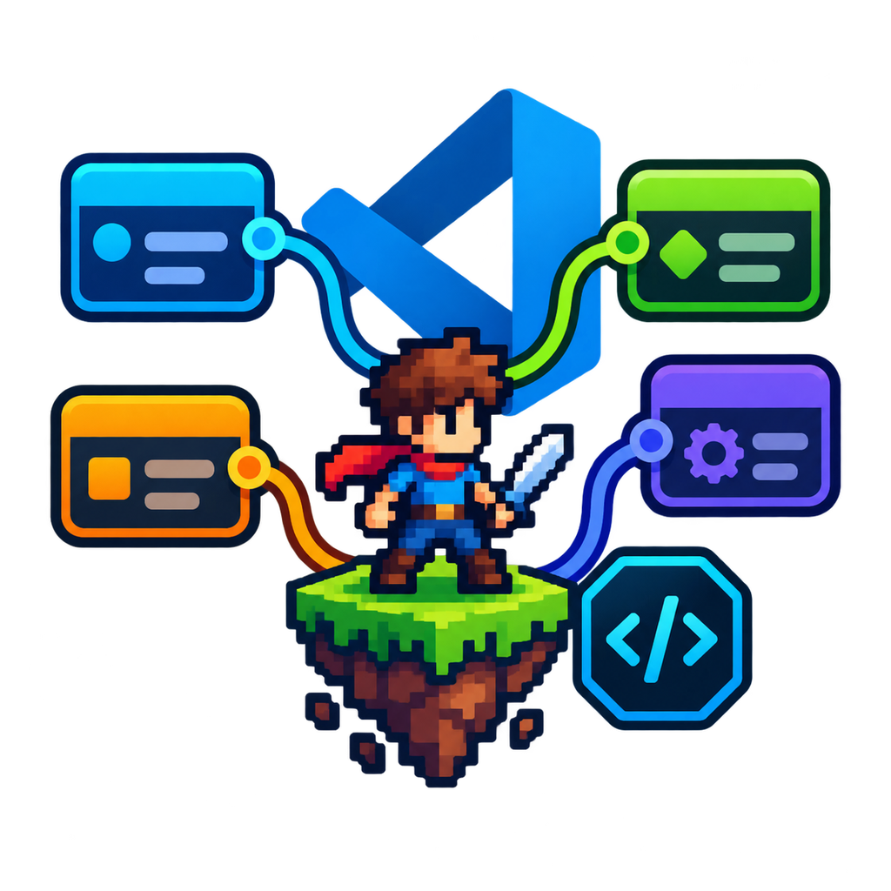

<!-- # 👾 GENGE - Game Engine Node Graph Editor -->

Dynamic facet-based code generator for multiple languages and frameworks.

---

<!-- Image & Icon -->

  
  
  <h3>✨ An extension that enables game creation across various engines (currently Godot) without coding✨</h3>

<!-- Static Badges -->

---

## 🎥 Demo

#### Built with ❤️ for developers who hate excessive code
